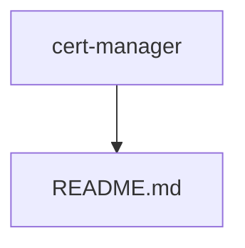
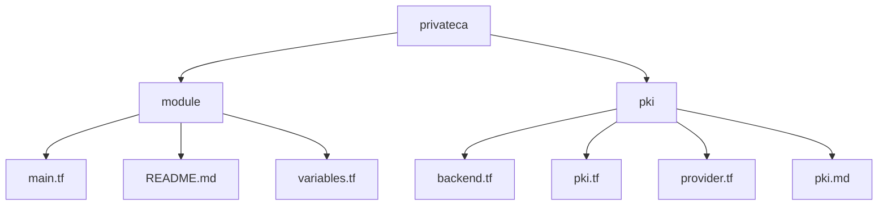

## Intro

This repository is dedicated to Google's Certificate Authority Service (CAS). The intend is to educate the end users about this service and it's usage and also provide them with terraform code to be able to deploy the infrastructure needed to use this service.

This repository hosts code and material which based on 

* https://cloud.google.com/blog/products/identity-security/how-to-deploy-google-cas-whitepaper
* https://github.com/jetstack/google-cas-issuer

Certificate Authority Service (CAS) is a highly available, scalable Google Cloud service that enables you to simplify, automate, and customize the deployment, management, and security of private certificate authorities (CA). 

The purpose of a public key infrastructure (PKI) to issue certificates is largely dependent on the environment in which the PKI-issued certificates will be used. For common internet-facing services, such as a website or host where visitors to the site are largely unknown to the host, a certificate that is trusted by the visitor is required to ensure a seamless validation of the host. If a visitor’s browser hasn’t been configured to trust the PKI from which the certificate was issued, an error will occur. To facilitate this process, publicly trusted certificate authorities issue certificates that can be broadly trusted throughout the world. However, their structure, identity requirements, certificate restrictions, and certificate cost make them ineffective for certificate needs within an organizational or private ecosystem, such as the internet of things (IoT) or DevOps.

## Repository structure

This repository contains two separate folders `cert-manager` and `privateca` and then sub-folders `module` and `pki` under `privateca`.  

1. cert-manager: Explains `cert-manager` technology and it's concepts in detail. 
2. privateca: Contains terraform module that can be re-used as needed and an example usage of the module






## Use case for a private PKI service 

Organizations that have a need for internally trusted certificates and little to no need for externally trusted certificates can have more flexibility, control, and security in their certificates without a per-certificate charge from commercial providers. 

A private PKI can be configured to issue the certificates an organization needs for a wide range of use cases, and can be configured to do so on a large scale, automated basis. Additionally, an organization can be assured that externally issued certificates cannot be used to access or connect to organizational resources.

The Google Cloud Certificate Authority Service (CAS) allows organizations to establish, secure and operate their own private PKI. Certificates issued by CAS will be trusted only by the devices and services an organization configures to trust the PKI.


## Highlights
* “CAS enables organizations to flexibly expand, integrate or establish a PKI for their needs. CAS can be used to establish and operate as an organization’s entire PKI or can be used to act as one or more CA components in the PKI along with on-premises or other CAs.”

* “There are several architectures that could be implemented to achieve goals within your organization and your PKI: Cloud root CA, cloud issuing CA and others” 

* “Providing a dispersed and highly available PKI for your organization can be greatly simplified through CAS Regionalization. When deploying your CA, you can easily specify the location of your CA.”

* “CAS provides two operational service tiers for a CA – DevOps and Enterprise. These two tiers provide organizations with a balance of performance and security based on operational requirements.”

## Features
 A global CA is hard to deploy and manage because of the expertise required that many org. don't have 
* Simpler Deployment and management 
   * Traditional CAs are not suitable for the modern use cases of DevOps and microservices for a variety of reasons - in flexible, not scalable, don't integrate with deployment & access control infra used within in Cloud services and expensive as well 
   * Create a private CA in minutes and focus on other high value tasks 

* Tailored for you 
   * In addition to simpler deployment and management, it can also be tailored to suit our specific needs
   * Create custom CAs and certificates
   * Automate common tasks with APIs
   * Integrate with existing services
   * CAs services are HA, scalable, secure, auditable and help achieve compliance for security controls

## Usage
[cert-manager](cert-manager) builds on top of Kubernetes, introducing certificate authorities and certificates as first-class resource types in the Kubernetes API. This makes it possible to provide ‘certificates as a service’ to developers working within your Kubernetes cluster.

cert-manager can be used for many different use cases within your clusters, including mutual TLS (mTLS) between workloads, and for securing traffic from end users with ingress. cert-manager provides integrations with many different ways of obtaining those certificates, including Let’s Encrypt, Venafi Trust Protection Platform, and a Certificate Authority issuer that allows for signing with a CA certificate obtained from any source.  

### How it works
Working closely with Google, we developed an external Issuer for cert-manager, in order to automate the lifecycle of certificates with a CAS-managed CA. The CAS Issuer is a separate controller to cert-manager and runs its own pod, enabling you to use the same interfaces to create and manage certificates in Kubernetes as you would publicly-trusted certificates (e.g. Let’s Encrypt).

Note: There's a separate folder named `cert-manager` in this repository that explains about the technology in detail. 


### Getting started

```
kubectl get googlecasclusterissuers

NAME                            AGE
googlecasclusterissuer-sample   10s
```

You can now create certificates as normal, but you just need to ensure the IssuerRef is set to the Google CAS Issuer.

```
cat <<EOF | kubectl apply -f -
apiVersion: cert-manager.io/v1
kind: Certificate
metadata:
  name: demo-certificate
  namespace: default
spec:
  # The secret name to store the signed certificate
  secretName: demo-cert-tls
  # Common Name
  commonName: cert-manager.io.demo
  # DNS SAN
  dnsNames:
    - cert-manager.io
    - jetstack.io
  # Duration of the certificate
  duration: 24h
  # Renew 8 hours before the certificate expiration
  renewBefore: 8h
  # Important: Ensure the issuerRef is set to the issuer or cluster issuer configured earlier
  issuerRef:
    group: cas-issuer.jetstack.io
    kind: GoogleCASClusterIssuer
    name: googlecasclusterissuer-sample
EOF
```

In short time, the certificate will be requested and made available to the cluster.

```
kubectl get certificates,secret
NAME                                          READY   SECRET         AGE
certificate.cert-manager.io/bar-certificate   True    demo-cert-tls  1m

NAME                                     TYPE                                  DATA   AGE
secret/demo-cert-tls                     kubernetes.io/tls                     3      1m
```

The certificate in this example had a duration of 24h, and cert-manager will automatically renew it 8h prior to expiry. You could also manually renew it with the kubectl plugin.
