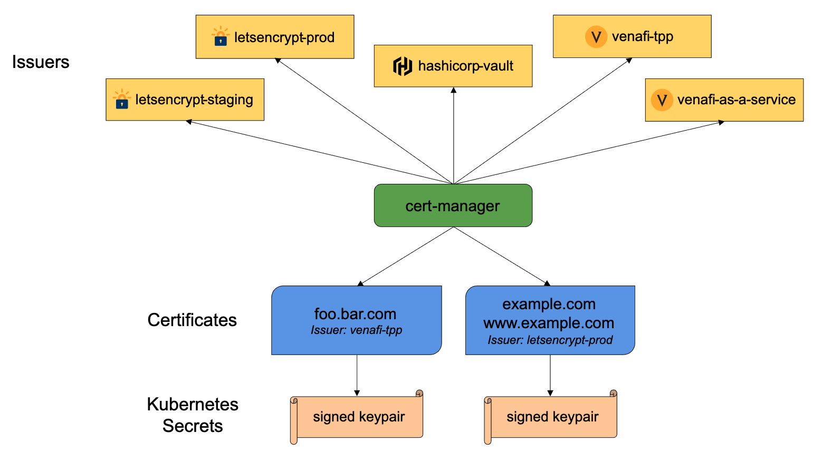

# cert-manager
cert-manager adds certificates and certificate issuers as resource types in Kubernetes clusters, and simplifies the process of obtaining, renewing and using those certificates.

It can issue certificates from a variety of supported sources, including Let’s Encrypt, HashiCorp Vault, and Venafi as well as private PKI.

It will ensure certificates are valid and up to date, and attempt to renew certificates at a configured time before expiry.

It is loosely based upon the work of kube-lego and has borrowed some wisdom from other similar projects such as kube-cert-manager.

## Concepts

### Issuer 

Issuers, and ClusterIssuers, are Kubernetes resources that represent certificate authorities (CAs) that are able to generate signed certificates by honoring certificate signing requests. All cert-manager certificates require a referenced issuer that is in a ready condition to attempt to honor the request.

An example of an Issuer type is CA. A simple CA Issuer is as follows:
```
apiVersion: cert-manager.io/v1
kind: Issuer
metadata:
  name: ca-issuer
  namespace: mesh-system
spec:
  ca:
    secretName: ca-key-pair
   ``` 
This is a simple Issuer that will sign certificates based on a private key. The certificate stored in the secret ca-key-pair can then be used to trust newly signed certificates by this Issuer in a Public Key Infrastructure (PKI) system.

#### Issuer Configuration
The first thing you’ll need to configure after you’ve installed cert-manager is an issuer which you can then use to issue certificates.

This section documents how the different issuer types can be configured. You might want to read more about Issuer and ClusterIssuer resources here.

cert-manager comes with a number of built-in certificate issuers which are denoted by being in the cert-manager.io group. You can also install external issuers in addition to the built-in types. Both built-in and external issuers are treated the same and are configured similarly.

When using ClusterIssuer resource types, ensure you understand the purpose of the Cluster Resource Namespace; this can be a common source of issues for people getting started with cert-manager.

##### Supported Issuer Types

* SelfSigned
* CA
* Vault
* Venafi
* External
* ACME

### Certificate 

cert-manager has the concept of Certificates that define a desired X.509 certificate which will be renewed and kept up to date. A Certificate is a namespaced resource that references an Issuer or ClusterIssuer that determine what will be honoring the certificate request.

When a Certificate is created, a corresponding CertificateRequest resource is created by cert-manager containing the encoded X.509 certificate request, Issuer reference, and other options based upon the specification of the Certificate resource.

Here is one such example of a Certificate resource.

```
apiVersion: cert-manager.io/v1
kind: Certificate
metadata:
  name: acme-crt
spec:
  secretName: acme-crt-secret
  dnsNames:
  - example.com
  - foo.example.com
  issuerRef:
    name: letsencrypt-prod
    # We can reference ClusterIssuers by changing the kind here.
    # The default value is Issuer (i.e. a locally namespaced Issuer)
    kind: Issuer
    group: cert-manager.io
```
### CertificateRequest

The CertificateRequest is a namespaced resource in cert-manager that is used to request X.509 certificates from an Issuer. The resource contains a base64 encoded string of a PEM encoded certificate request which is sent to the referenced issuer. A successful issuance will return a signed certificate, based on the certificate signing request. CertificateRequests are typically consumed and managed by controllers or other systems and should not be used by humans - unless specifically needed.

A simple CertificateRequest looks like the following:
```
apiVersion: cert-manager.io/v1
kind: CertificateRequest
metadata:
  name: my-ca-cr
spec:
  request: LS0tLS1CRUdJTiBDRVJUSUZJQ0FURSBSRVFVRVNULS0tLS0KTUlJQzNqQ0NBY1lDQVFBd2daZ3hDekFKQmdOVkJBWVRBbHBhTVE4d0RRWURWUVFJREFaQmNHOXNiRzh4RFRBTApCZ05WQkFjTUJFMXZiMjR4RVRBUEJnTlZCQW9NQ0VwbGRITjBZV05yTVJVd0V3WURWUVFMREF4alpYSjBMVzFoCmJtRm5aWEl4RVRBUEJnTlZCQU1NQ0dwdmMyaDJZVzVzTVN3d0tnWUpLb1pJaHZjTkFRa0JGaDFxYjNOb2RXRXUKZG1GdWJHVmxkWGRsYmtCcVpYUnpkR0ZqYXk1cGJ6Q0NBU0l3RFFZSktvWklodmNOQVFFQkJRQURnZ0VQQURDQwpBUW9DZ2dFQkFLd01tTFhuQkNiRStZdTIvMlFtRGsxalRWQ3BvbHU3TlZmQlVFUWl1bDhFMHI2NFBLcDRZQ0c5Cmx2N2kwOHdFMEdJQUgydnJRQmxVd3p6ZW1SUWZ4YmQvYVNybzRHNUFBYTJsY2NMaFpqUlh2NEVMaER0aVg4N3IKaTQ0MWJ2Y01OM0ZPTlRuczJhRkJYcllLWGxpNG4rc0RzTEVuZmpWdXRiV01Zeis3M3ptaGZzclRJUjRzTXo3cQpmSzM2WFM4UkRjNW5oVVcyYU9BZ3lnbFZSOVVXRkxXNjNXYXVhcHg2QUpBR1RoZnJYdVVHZXlZUUVBSENxZmZmCjhyOEt3YTFYK1NwYm9YK1ppSVE0Nk5jQ043OFZnL2dQVHNLZmphZURoNWcyNlk1dEVidHd3MWdRbWlhK0MyRHIKWHpYNU13RzJGNHN0cG5kUnRQckZrU1VnMW1zd0xuc0NBd0VBQWFBQU1BMEdDU3FHU0liM0RRRUJDd1VBQTRJQgpBUUFXR0JuRnhaZ0gzd0N3TG5IQ0xjb0l5RHJrMUVvYkRjN3BJK1VVWEJIS2JBWk9IWEFhaGJ5RFFLL2RuTHN3CjJkZ0J3bmlJR3kxNElwQlNxaDBJUE03eHk5WjI4VW9oR3piN0FVakRJWHlNdmkvYTJyTVhjWjI1d1NVQmxGc28Kd005dE1QU2JwcEVvRERsa3NsOUIwT1BPdkFyQ0NKNnZGaU1UbS9wMUJIUWJSOExNQW53U0lUYVVNSFByRzJVMgpjTjEvRGNMWjZ2enEyeENjYVoxemh2bzBpY1VIUm9UWmV1ZEp6MkxmR0VHM1VOb2ppbXpBNUZHd0RhS3BySWp3ClVkd1JmZWZ1T29MT1dNVnFNbGRBcTlyT24wNHJaT3Jnak1HSE9tTWxleVdPS1AySllhaDNrVDdKU01zTHhYcFYKV0ExQjRsLzFFQkhWeGlKQi9Zby9JQWVsCi0tLS0tRU5EIENFUlRJRklDQVRFIFJFUVVFU1QtLS0tLQo=
  isCA: false
  usages:
  - signing
  - digital signature
  - server auth
  # 90 days
  duration: 2160h
  issuerRef:
    name: ca-issuer
    # We can reference ClusterIssuers by changing the kind here.
    # The default value is Issuer (i.e. a locally namespaced Issuer)
    kind: Issuer
    group: cert-manager.io
```

This CertificateRequest will make cert-manager attempt to request the Issuer ca-issuer in the default issuer group cert-manager.io, return a certificate based upon the certificate signing request. Other groups can be specified inside the issuerRef which will change the targeted issuer to other external, third party issuers you may have installed.

The resource also exposes the option for stating the certificate as CA, Key Usages, and requested validity duration.

All fields within the spec of the CertificateRequest, as well as any managed cert-manager annotations, are immutable and cannot be modified after creation.

A successful issuance of the certificate signing request will cause an update to the resource, setting the status with the signed certificate, the CA of the certificate (if available), and setting the Ready condition to True.

Whether issuance of the certificate signing request was successful or not, a retry of the issuance will not happen. It is the responsibility of some other controller to manage the logic and life cycle of CertificateRequests.

### Webhook 

cert-manager makes use of extending the Kubernetes API server using a Webhook server to provide dynamic admission control over cert-manager resources. This means that cert-manager benefits from most of the same behavior that core Kubernetes resource have. The webhook has three main functions:

ValidatingAdmissionWebhook: Ensures that when cert-manager resources are created or updated, they conform to the rules of the API. This validation is more in depth than for example ensuring resources conform to the OpenAPI schema, but instead contains logic such as not allowing to specify more than one Issuer type per Issuer resource. The validating admission is always called and will respond with a success or failed response.
MutatingAdmissionWebhook: Changes the contents of resources during create and update operations, for example to set default values.
CustomResourceConversionWebhook: The webhook is also responsible for implementing a conversion over versions in the cert-manager CustomResources (cert-manager.io). This means that multiple API versions can be supported simultaneously; from v1alpha2 through to v1. This makes it possible to rely on a particular version of our configuration schema.
The webhook component is deployed as another pod that runs alongside the main cert-manager controller and CA injector components.

In order for the API server to communicate with the webhook component, the webhook requires a TLS certificate that the apiserver is configured to trust. This is created by the cainjector and is implemented by the following two Secrets:

* secret/cert-manager-webhook-ca: A self-signed root CA certificate which is used to sign certificates for the webhook pod.*
* secret/cert-manager-webhook-tls: A TLS certificate issued by the root CA above, served by the webhook.


### CA Injector
cainjector helps to configure the CA certificates for: Mutating Webhooks, Validating Webhooks, and Conversion Webhooks.

In particular, cainjector populates the caBundle field of three API types: ValidatingWebhookConfiguration, MutatingWebhookConfiguration, and CustomResourceDefinition. These APIs are used to configure how the Kubernetes API server connects to webhooks. This caBundle data is loaded by the Kubernetes API server and used to verify the serving certificates of webhook API servers. We will refer to these three API types as the injectable resources.

An injectable resource MUST have one of these annotations: cert-manager.io/inject-ca-from, cert-manager.io/inject-ca-from-secret, or cert-manager.io/inject-apiserver-ca, depending on the injection source. This is explained in more detail below.

cainjector copies CA data from one of three sources: a Kubernetes Secret, a cert-manager Certificate, or from the Kubernetes API server CA certificate (which cainjector itself uses to verify its TLS connection to the Kubernetes API server).

If the source is a Kubernetes Secret, that resource MUST also have an cert-manager.io/allow-direct-injection: "true" annotation. The three source types are explained in more detail below.


## External issuers

cert-manager supports external Issuer types. While external issuers are not implemented in the main cert-manager repository, they are otherwise treated the same as any other issuer.

External issuers are typically deployed as a pod which is configured to watch for CertificateRequest resources in the cluster whose issuerRef matches the name of the issuer. External issuers exist outside of the cert-manager.io group.

Installation for each issuer may differ; check the documentation for each external issuer for more details on installing, configuring and using it.

### Google-cas-issuer

Google Certificate Authority Service Issuer for cert-manager
This repository contains an external Issuer for cert-manager that issues certificates using Google Cloud Certificate Authority Service (CAS), using managed private CAs to issue certificates.

## Getting started


### Prerequisites


#### CAS-enabled GCP project

Enable the Certificate Authority API (privateca.googleapis.com) in your GCP project by following the official documentation.

##### CAS-managed Certificate Authorities

You can create a ca pool containing a certificate authority in your current Google project with:

```
gcloud privateca pools create my-pool --location us-east1
gcloud privateca roots create my-ca --pool my-pool --key-algorithm "ec-p384-sha384" --subject="CN=my-root,O=my-ca,OU=my-ou" --max-chain-length=2 --location us-east1
```

You should also enable the root CA you just created when prompted by `gcloud`.

It is recommended to create subordinate CAs for signing leaf certificates. See the official documentation.

cert-manager

If not already running in the cluster, install `cert-manager` by following the official documentation.

#### Installing Google CAS Issuer for cert-manager

Assuming that you have installed `cert-manager` in the cert-manager namespace, you can use a single kubectl command to install Google CAS Issuer. Visit the GitHub releases, select the latest release and copy the command, e.g.

```
kubectl apply -f https://github.com/jetstack/google-cas-issuer/releases/download/v0.5.2/google-cas-issuer-v0.5.2.yaml
```

You can then skip to the Setting up Google Cloud IAM section.

#### Customise the deployment (for developers)

Examine the ClusterRole and ClusterRolebinding in `config/rbac/role.yaml` and `config/rbac/role_binding.yaml`. By default, these give the `ksa-google-cas-issuer` Kubernetes service account in the cert-manager namespace all the necessary permissions. Customise these to your needs.

```
kubectl create serviceaccount -n cert-manager ksa-google-cas-issuer

kubectl apply -f config/rbac/role.yaml
kubectl apply -f config/rbac/role_binding.yaml
```

Install the Google CAS Issuer CRDs in `config/crd`. These manifests use kustomization (hence the `-k` option).

```
kubectl apply -k config/crd
```

Build and push the controller image

Note: you can skip this step if using the public images at quay.io.

To build the image, ensure you have kubebuilder installed.

Build the docker image:

```
make docker-build
```

Push the docker image or load it into kind for testing

```
make docker-push || kind load docker-image quay.io/jetstack/cert-manager-google-cas-issuer:latest
```

#### Deploy the controller

##### Deploy the issuer controller:

```
cat <<EOF | kubectl apply -f -
apiVersion: apps/v1
kind: Deployment
metadata:
  name: google-cas-issuer
  namespace: cert-manager
  labels:
    app: google-cas-issuer
spec:
  selector:
    matchLabels:
      app: google-cas-issuer
  replicas: 1
  template:
    metadata:
      labels:
        app: google-cas-issuer
    spec:
      serviceAccountName: ksa-google-cas-issuer
      containers:
      # update the image to your registry if you built and pushed your own image.
      - image: quay.io/jetstack/cert-manager-google-cas-issuer:latest
        imagePullPolicy: IfNotPresent
        name: google-cas-issuer
        resources:
          limits:
            cpu: 100m
            memory: 30Mi
          requests:
            cpu: 100m
            memory: 20Mi
      terminationGracePeriodSeconds: 10
EOF
```

By default, the Google CAS Issuer controller will be deployed into the `cert-manager` namespace.

```
NAME                                      READY   STATUS    RESTARTS   AGE
cert-manager-6cd8cb4b7c-m8q4k             1/1     Running   0          34h
cert-manager-cainjector-685b87b86-4jvtb   1/1     Running   1          34h
cert-manager-webhook-76978fbd4c-rrx85     1/1     Running   0          34h
google-cas-issuer-687685dc46-lrjkc        1/1     Running   0          28h
```

#### Setting up Google Cloud IAM

Firstly, create a Google Cloud IAM service account. This service account will be used by the CAS Issuer to access the Google Cloud CAS APIs.

```
gcloud iam service-accounts create sa-google-cas-issuer
```

Apply the appropriate IAM bindings to this account. This example permits the least privilege, to create certificates (ie `roles/privateca.certificates.create`) from a specified CA pool (`my-pool`), but you can use other roles as necessary (see Predefined Roles for more details).

```
gcloud privateca pools add-iam-policy-binding my-pool --role=roles/privateca.certificateRequester --member="serviceAccount:sa-google-cas-issuer@$(gcloud config get-value project | tr ':' '/').iam.gserviceaccount.com" --location=us-east1
```

#### Inside GKE with workload Identity

Workload identity lets you bind a Kubernetes service account to a Google Cloud service account. In order to take advantage of this, your GKE cluster must be set up to use it. If you want to create a cluster from scratch to test the issuer, you can enable it like so:

```
gcloud container clusters create test --region us-east1 --num-nodes=1 --preemptible \
  --workload-pool=$(gcloud config get-value project | tr ':' '/').svc.id.goog
```
If you want to use the CAS issuer in an existing cluster, you can still enable the workload identity feature with:

```
gcloud container clusters update CLUSTER_NAME --region=CLUSTER_REGION \
  --workload-pool="$(gcloud config get-value project | tr ':' '/').svc.id.goog"
```

Bind the Kubernetes service account (`ksa-google-cas-issuer`) to the Google Cloud service account:

```
export PROJECT=$(gcloud config get-value project | tr ':' '/')

gcloud iam service-accounts add-iam-policy-binding \
  --role roles/iam.workloadIdentityUser \
  --member "serviceAccount:$PROJECT.svc.id.goog[cert-manager/ksa-google-cas-issuer]" \
  sa-google-cas-issuer@${PROJECT:?PROJECT is not set}.iam.gserviceaccount.com

kubectl annotate serviceaccount \
  --namespace cert-manager \
  ksa-google-cas-issuer \
  iam.gke.io/gcp-service-account=sa-google-cas-issuer@${PROJECT:?PROJECT is not set}.iam.gserviceaccount.com \
  --overwrite=true
```

#### Outside GKE or in an unrelated GCP project

Create a key for the service account and download it to a local JSON file.

```
gcloud iam service-accounts keys create $(gcloud config get-value project | tr ':' '/')-key.json \
  --iam-account sa-google-cas-issuer@$(gcloud config get-value project | tr ':' '/').iam.gserviceaccount.com
```

The service account key should be stored in a Kubernetes secret in your cluster so it can be accessed by the CAS Issuer controller.

```
 kubectl -n cert-manager create secret generic googlesa --from-file $(gcloud config get-value project | tr ':' '/')-key.json
```

#### Configuring the Issuer

cert-manager is configured for Google CAS using either a `GoogleCASIssuer` (namespace-scoped) or a `GoogleCASClusterIssuer` (cluster-wide).

Inspect the sample configurations below and update the PROJECT_ID as appropriate. Credentials can be omitted if you have configured the CAS issuer controller with Workload Identity.

```
# googlecasissuer-sample.yaml
apiVersion: cas-issuer.jetstack.io/v1beta1
kind: GoogleCASIssuer
metadata:
  name: googlecasissuer-sample
spec:
  project: $PROJECT_ID
  location: us-east1
  caPoolId: my-pool
  # credentials are optional if workload identity is enabled
  credentials:
    name: "googlesa"
    key: "$PROJECT_ID-key.json"
```

```   
kubectl apply -f googlecasissuer-sample.yaml
```

or

```
# googlecasclusterissuer-sample.yaml
apiVersion: cas-issuer.jetstack.io/v1beta1
kind: GoogleCASClusterIssuer
metadata:
  name: googlecasclusterissuer-sample
spec:
  project: $PROJECT_ID
  location: us-east1
  caPoolId: my-pool
  # credentials are optional if workload identity is enabled
  credentials:
    name: "googlesa"
    key: "$PROJECT_ID-key.json"
```

```    
kubectl apply -f googlecasclusterissuer-sample.yaml
```

#### Creating your first certificate

You can now create certificates as normal, but ensure the `IssuerRef` is set to the `GoogleCASIssuer` or `GoogleCASClusterIssuer` created in the previous step.

```
apiVersion: cert-manager.io/v1
kind: Certificate
metadata:
  name: demo-certificate
  namespace: default
spec:
  # The secret name to store the signed certificate
  secretName: demo-cert-tls
  # Common Name
  commonName: cert-manager.io.demo
  # DNS SAN
  dnsNames:
    - cert-manager.io
    - jetstack.io
  # Duration of the certificate
  duration: 24h
  # Renew 8 hours before the certificate expiration
  renewBefore: 8h
  # Important: Ensure the issuerRef is set to the issuer or cluster issuer configured earlier
  issuerRef:
    group: cas-issuer.jetstack.io
    kind: GoogleCASClusterIssuer # or GoogleCASIssuer
    name: googlecasclusterissuer-sample # or googlecasissuer-sample
```

```
kubectl apply -f demo-certificate.yaml
```

In short time, the certificate will be requested and made available to the cluster.

```
kubectl get certificates,secret
NAME                                           READY   SECRET         AGE
certificate.cert-manager.io/demo-certificate   True    demo-cert-tls  1m

NAME                                     TYPE                                  DATA   AGE
secret/demo-cert-tls                     kubernetes.io/tls                     3      1m
```